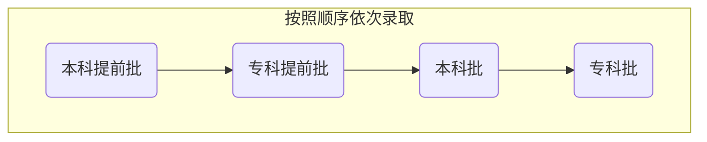
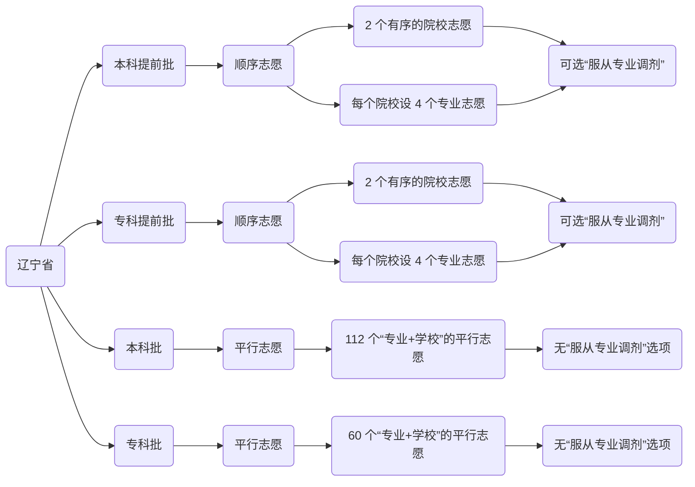

:::default

[**文章摘要**]{.label}

高考报考流程与名词解释。

:::

<!--more-->

> 适用地区：辽宁省。
>
> 适用年份：2022年前后。

# 认识高考

## 高考改革

谈及高考报考，就不得不说近十几年的高考改革。

2008 年开始，辽宁省开始试点“平行志愿”的投档方式，增加了高考分数在报考中的权重，弱化了报考策略在报考中的作用，是高考报考体系对考生来讲更加公平。

而从 2010 年开始，全国范围内开始推广“知分填报”方式，使得高考报考更加清晰明了，再次增加了高考分数在报考中的权重。辽宁省自 2014 年开始采用“知分填报”方式，并在同年开始使用“网上填报”的方式取代了“纸质填报”的方式，在报考方式上更贴近时代，大大提高了报考与招生的效率。

到了 2021 年，辽宁省迎来了第一届“新高考”，这一批 2018 年入学的考生采用了全新的 “3+1+2”模式进行选科，以往的考试与报考模式已经不再适用于他们，于是辽宁省将高考报考模式改为“新高考”模式，以“专业+院校”的方式对平行志愿进行重新划分。

## 高考模式

随着一波又一波的高考改革，如今在全国同时存在着三种不同的高考模式。他们有的是保持传统，有个成为改革的试点。在互联网时代，获取信息的信息并不会被地域分隔，所以对所有高考模式的了解，能够让我们更明确的知道：哪些信息才是对自己有效的。

### 3+X 模式

这个就是俗称的“传统高考模式”，在 2018 年以前入学的辽宁省高中生，均是该模式的亲历者。现如今，这个模式仍作为全国高考的主流模式，在全国大部分地区实行。

- 必考科目：语文、数学、外语
- 选考科目：理科综合、文科综合

除去三大主科作为必考科目外，将物理、化学、生物三门学科合出一套理科综合试卷，将政治、历史、地理合出一套文科综合试卷。考生在高一时决定自己的文理学习方向，更针对性的对人才进行培养。

### 3+3 模式

这是新高考的一个改革模式，目前在天津、山东等六省市实行。

- 必考科目：语文、数学、外语
- 选考科目：物理、历史、政治、地理、生物、化学

不出意外的三大主科作为必考科目，而其他六门学科完全由学生自主选择三门来进行学习。对学生来讲灵活性较大，但实际上在高考改革的试点阶段，上下游配套方案并为成熟，过多的选择方向反而会让学生与家长更难以做出决定。

### 3+1+2 模式

这也是新高考的一个改革模式，目前在河北、辽宁等八省市实行。

- 必考科目：语文、数学、外语
- 方向科目：物理、历史
- 选考科目：政治、地理、生物、化学

与“3+3 模式”对比，我觉得 “3+1+2”模式相对而言更加合理一些。首先是不可避免的必考科目，然后配合一个方向科目进行一个大方向的把控，最后再根据自己的爱好与优势，选考两门学科。既不会让学生陷入无法选择的局面，又适度增加了学生可选择的细节发展方向，达到了高考改革的目标。

## 报考方式

在新一轮的高考改革中，各省市对于高考模式都已经进行了调整，那么原有的高考报考方式就可能出现与整套系统不匹配的情况，对此各省市针对性的修改了高考报考方式。目前来看，全国主要实行的报考方式有以下三种：

- 传统高考模式：大部分地区
- 专业组模式：湖南、湖北、江苏、福建、广东
- 新高考模式：河北、辽宁、重庆

这里可以看出，报考方式与高考模式的省市名单并不完全匹配，这也说明了高考改革仍在进行中，且新的高考方案并不是一刀切，而是根据各省市具体情况进行细致调整。

对于辽宁省的“新高考”模式，我在后面会详细讲。

##  资讯节点

高考报考是一个短时间任务，所以对于时间节点的把控，信息资源的筛选，都有较高要求。所以首先需要了解高考报考中的关键时间节点，便于把控任务进度。

在短时间任务中，互联网的庞大信息量并不是一个有利的条件，我们要对大量的信息进行筛选整理，从中找到对自己有利的信息，而这其中就有大量的广告、过期信息、错误的小道消息，如何降低自己的工作量？答案是找到正确的信息源。

| 网站名称           | 网址                              | 网站背书   |
| ------------------ | --------------------------------- | ---------- |
| 阳光高考网         | https://gaokao.chsi.com.cn        | 教育部     |
| 辽宁省招生考试之窗 | https://www.lnzsks.com/index.html | 辽宁省招办 |
| 各院校官方网站     | ———                               | 各院校     |

从以上三个渠道获得的信息均为对应的官方信息，杜绝小道消息与广告的干扰，且信息均按时间顺序排列，各网站也会根据每年的不同情况发布最新的资讯指南，信息质量较高。

# 志愿填报

在志愿填报阶段，考生及家长应该做到“三知”：知分、知位、知线。其中“知分”就是知道考生的考试分数，他仅仅作为填报的一个基础数据，并没有什么需要详细展开的内容。

## 报考三知——知位

知位，即知道考生成绩在本省的排名位置，是报考的重要依据。由于政策的不同，试题难易度的不同，每年的高考成绩分布并不一致，所以考试分数作为一个绝对数据并不能指导我们报考，我们需要知道在今年的高考中，自己的成绩的客观排位，是否能够被院校提档，这就是知位。

### 一分一段表

所谓“一分一段”，是将全省同科类考生的档案分（高考各科成绩＋优惠加分）从高到低排列，再以“1分”为单位，统计获得该分数的考生人数和累计人数。一分一段表是重要的报考工具，考生可以通过一分一段表计算出自己在全省的排名，知道与自己分数相同或相近的考生有多少，进而预估被院校录取的概率。

对于一分一段表的使用，首先是通过分数计算出自己在全省的排名，结合同梯度院校在本省的招生计划的总和，明确自己所处的位置。再来是结合往年的一分一段表，看一看同梯度院校在本省的录取分数线在什么位置，与自己分数所处的位置关系。

|   分数    | 人数 | 累计 |    选科    | 省份 | 年份 |
| :-------: | :--: | :--: | :--------: | :--: | :--: |
| 675及以上 |  10  |  10  | 历史学科类 | 辽宁 | 2021 |
|    674    |  2   |  12  | 历史学科类 | 辽宁 | 2021 |
|    673    |  1   |  13  | 历史学科类 | 辽宁 | 2021 |
|    672    |  3   |  16  | 历史学科类 | 辽宁 | 2021 |
|    671    |  2   |  18  | 历史学科类 | 辽宁 | 2021 |
|    670    |  3   |  21  | 历史学科类 | 辽宁 | 2021 |
|    669    |  5   |  26  | 历史学科类 | 辽宁 | 2021 |
|    668    |  2   |  28  | 历史学科类 | 辽宁 | 2021 |
|    667    |  2   |  30  | 历史学科类 | 辽宁 | 2021 |
|    666    |  5   |  35  | 历史学科类 | 辽宁 | 2021 |
|    665    |  2   |  37  | 历史学科类 | 辽宁 | 2021 |
|    664    |  9   |  46  | 历史学科类 | 辽宁 | 2021 |
|    663    |  7   |  53  | 历史学科类 | 辽宁 | 2021 |
|    662    |  7   |  60  | 历史学科类 | 辽宁 | 2021 |
|    661    |  7   |  67  | 历史学科类 | 辽宁 | 2021 |
|    660    |  8   |  75  | 历史学科类 | 辽宁 | 2021 |
|    659    |  7   |  82  | 历史学科类 | 辽宁 | 2021 |
|    658    |  6   |  88  | 历史学科类 | 辽宁 | 2021 |
|    ……     |  ……  |  ……  |     ……     |  ……  |  ……  |

|   分数    | 人数 | 累计 |    选科    | 省份 | 年份 |
| :-------: | :--: | :--: | :--------: | :--: | :--: |
| 706及以上 |  10  |  10  | 物理学科类 | 辽宁 | 2021 |
|    705    |  2   |  12  | 物理学科类 | 辽宁 | 2021 |
|    704    |  5   |  17  | 物理学科类 | 辽宁 | 2021 |
|    703    |  2   |  19  | 物理学科类 | 辽宁 | 2021 |
|    702    |  6   |  25  | 物理学科类 | 辽宁 | 2021 |
|    701    |  6   |  31  | 物理学科类 | 辽宁 | 2021 |
|    700    |  7   |  38  | 物理学科类 | 辽宁 | 2021 |
|    699    |  1   |  39  | 物理学科类 | 辽宁 | 2021 |
|    698    |  5   |  44  | 物理学科类 | 辽宁 | 2021 |
|    697    |  4   |  48  | 物理学科类 | 辽宁 | 2021 |
|    696    |  7   |  55  | 物理学科类 | 辽宁 | 2021 |
|    695    |  12  |  67  | 物理学科类 | 辽宁 | 2021 |
|    694    |  9   |  76  | 物理学科类 | 辽宁 | 2021 |
|    693    |  16  |  92  | 物理学科类 | 辽宁 | 2021 |
|    692    |  15  | 107  | 物理学科类 | 辽宁 | 2021 |
|    691    |  14  | 121  | 物理学科类 | 辽宁 | 2021 |
|    690    |  16  | 137  | 物理学科类 | 辽宁 | 2021 |
|    689    |  16  | 153  | 物理学科类 | 辽宁 | 2021 |
|    ……     |  ……  |  ……  |     ……     |  ……  |  ……  |

### 同位分

在比对今年与去年，或前年的一分一段表时候，我们会发现不同年份在相同位置的考生成绩并不相同，而这个差异也是可以用于指导报考的一个参考数据，所以我们以“同位分”对其命名，即相同位次不同年份的对应分数。我们可以通过查看近几年的一分一段表，确定同梯度院校录取线在今年的同位分，作为报考参考数据。建议对近三年的同位分进行统计，以便更加准确的进行报考。

| 分数 | 人数 | 累计  |    选科    | 省份 | 年份 |
| :--: | :--: | :---: | :--------: | :--: | :--: |
|  ……  |  ……  |  ……   |     ……     |  ……  |  ……  |
| 575  | 289  | 17183 | 物理学科类 | 辽宁 | 2021 |
| 574  | 297  | 17484 | 物理学科类 | 辽宁 | 2021 |
| 573  | 268  | 18046 | 物理学科类 | 辽宁 | 2021 |
|  ……  |  ……  |  ……   |     ……     |  ……  |  ……  |

| 分数 | 人数 | 累计  |   选科   | 省份 | 年份 |
| :--: | :--: | :---: | :------: | :--: | :--: |
|  ……  |  ……  |  ……   |    ……    |  ……  |  ……  |
| 571  | 267  | 17103 | 普通理工 | 辽宁 | 2020 |
| 570  | 246  | 17349 | 普通理工 | 辽宁 | 2020 |
| 569  | 310  | 17659 | 普通理工 | 辽宁 | 2020 |
|  ……  |  ……  |  ……   |    ……    |  ……  |  ……  |

| 分数 | 人数 | 累计  |   选科   | 省份 | 年份 |
| :--: | :--: | :---: | :------: | :--: | :--: |
|  ……  |  ……  |  ……   |    ……    |  ……  |  ……  |
| 573  | 280  | 17005 | 普通理工 | 辽宁 | 2019 |
| 572  | 316  | 17321 | 普通理工 | 辽宁 | 2019 |
| 571  | 335  | 17656 | 普通理工 | 辽宁 | 2019 |
|  ……  |  ……  |  ……   |    ……    |  ……  |  ……  |

## 报考三知——知线

知线，即知道本省的批次线。院校招生以批次划分阶段，理论上每个批次，考生均有一次被提档的机会。而根据各省考生的高考成绩水平和当年高校的招生计划，按一定的比例（不超过 120%）确定的录取新生的各批次、各科类最低成绩标准就称为批次线。辽宁省并未在招生简章给出明确的批次线划分标准，所以只能推测应该是介于 100% 到 120% 之间。

我们发现，批次线并不是按照 1:1 的比例划分的，所以并不是过了批次线就一定能够成功被对应批次学校录取。成绩在批次线附近的考生，报考时要兼顾下一批次学校的报考志愿一应对掉档的情况。

| 年份 | 省市 | 批次 | 选科 | 批次线 |
| :--: | :--: | :--: | :--: | :----: |
| 2021 | 辽宁 | 本科 | 物理 |  336   |
| 2021 | 辽宁 | 本科 | 历史 |  456   |
| 2021 | 辽宁 | 专科 | 物理 |  150   |
| 2021 | 辽宁 | 专科 | 历史 |  150   |
| 2020 | 辽宁 | 本科 | 理科 |  359   |
| 2020 | 辽宁 | 本科 | 文科 |  472   |
| 2020 | 辽宁 | 专科 | 理科 |  150   |
| 2020 | 辽宁 | 专科 | 文科 |  150   |
| 2019 | 辽宁 | 本科 | 理科 |  369   |
| 2019 | 辽宁 | 本科 | 文科 |  482   |
| 2019 | 辽宁 | 专科 | 理科 |  150   |
| 2019 | 辽宁 | 专科 | 文科 |  150   |

### 批次划分

想要知道批次线，首先要知道都有哪些批次。这里为将辽宁省高报报名的批次划分简单列出。

“本科提前批”与“专科提前批”统称为“提前批”。该批次是在普通批次前对考生进行提档录取，从结果上来讲给考生提供了多一次的被提档机会。而该批次的院校与专业是有明确要求的，并不是所有的院校与专业都可以进入提前批招生。

> 军事、公安、飞行学员、公费师范生、农村订单定向医学生、部分艺术专业、航海类等艰苦专业、全国重点马克思主义学院的马克思主义理论专业以及其他经教育部批准的特殊高校（专业）、有关高校综合评价招生等教育部规定可安排在提前批次录取的情况外，其余高校和专业一律不得安排在提前批次录取。

本科批即普通本科院校招生批次，该批次院校毕业后可获得学士学位。本科学校的学制一般来讲是四年，但医学类专业与建筑学专业是五年制。而对于专升本的考生来说，本科学制为两年制。根据办学主体的不同，本科院校还可以分为公办院校（辽宁师范大学）、民办院校（大连东软信息学院）和独立院校（辽宁师范大学海华学院），其中民办院校与独立学院就是我们常说的“三本”。

专科批即专科院校招生批次，其中包括高等专科学校（高专）与高等职业学院（高职），这两类院校都属于专科教育层次，相对来讲高等专科学校侧重点在于培养学生的应用理论，而高等职业学院侧重点在于培养学生的实践应用。

在院校招生过程中，是按照批次顺序分批录取的，如果考生已经被本科提前批录取，则不会参加本科批的院校提档。

> **模拟问答 1**
>
> **问题**：张同学本科提前批次报考军校，顺利通过体检、政审、面试后被录取。入学后经复查，   身体不合格被退回。他是否还有机会被普通本科批次填报的学校录取？
>
> **答案**：没有机会。
>
> **解析**：他已经被提前批次录取，档案已经被提走，普通本科批无法看到他的档案。且学校均已开学，招生工作已经结束。
>
> **提醒**：军事类学校在入学后，学校会组织体检核对考生身体信息。

> **模拟问答 2**
>
> **问题**：张同学本科提前批次报考军校，过几天接到体检通知，但体检时由于身体不符合要求，未被录取。请问是否影响他本科批的录取？
>
> **答案**：不影响。
>
> **解析**：他并未被本科提前批录取，本科批仍可以看到他的档案，所以不影响他本科批的录取。

> **模拟问答 3**
>
> **问题**：张同学高考成绩 625 分，本科提前批报考的陆军工程大学（体检政审均合格），录取分数为 585 分。本科普通批次报考的东北大学自动化类（大类招生），录取分数为 622 分。请问他会被哪个学校录取？
>
> **答案**：陆军工程大学。
>
> **解析**：他在本科提前批直接被陆军工程大学录取，本科批无法看到他的档案。
>
> **提醒**：提前批虽然是一个机会，但如果报考策略错误，反而会浪费分数影响报考结果。

## 志愿填报

接下来我们需要直面志愿填报这件事了，高考志愿到底怎么报？辽宁省有多少个批次？每个批次能报多少个志愿？每个志愿的权重都是一样的吗？我填报的这么多个志愿到底哪个志愿会被录取？我们来一一解决这些问题。

### 志愿配置

这里可以看出，辽宁省在提前批与本科批、专科批还采用了不同的志愿类型。那么接下来就介绍一下这两种不同的志愿类型有什么不同。

### 顺序志愿

“顺序志愿”投档方式，秉承“志愿优先，遵循分数”的原则。

考生填报的志愿存在先后顺序（第一志愿、第二志愿、……），然后各院校以志愿顺序分层，对报考考生成绩进行排名，分数从高到低录取。该投档方式中，同一批次会有多次提档机会，且设有“专业调剂”选项，当考生分数达到院校录取线时，可以以牺牲专业选择权为代价进入报考的院校就读。考生志愿顺序会对录取结果造成一定影响，报考策略对报考结果影响较大。

### 平行志愿

“平行志愿”投档方式，秉承“分数优先，遵循志愿，一次投档”的原则。

各省将所有学生成绩排名后，按成绩高低顺序分别对每一考生志愿进行一次检索，成绩高的考生先进行检索。虽说是平行志愿，但考生自己报的志愿存在先后顺序，从前到后第一个检索到的符合提档条件的志愿会被提档。该投档方式中，同一批次仅一次提档机会，且没有“专业调剂”选项，发生退档即本批次其他志愿全部作废。这是一个更加注重分数的投档方式，对于应试教育考生来说更加公平。可填报志愿数量大幅提升，机会变大的同时风险略有提高。

虽然报考策略对于报考结果的影响没有“顺序志愿”那么显著，不过该模式下考生与家长会陷入选择太多而无从下手的困境，从另一个角度增加了报考难度。

### 志愿填报表

网上填报虽然摒弃了纸质版表格的形式，但是需要填报的内容依然是存在的，对于大部分考生较为关注本科批与专科批，志愿填报表格式如下。

| 录取批次 | 序号 | 院校代码 | 院校名称 | 专业代码 | 专业名称 |
| :------: | :--: | :------: | :------: | :------: | :------: |
|  本科批  |  1   |          |          |          |          |
|  本科批  |  2   |          |          |          |          |
|    ……    |  ……  |    ……    |    ……    |    ……    |    ……    |
|  本科批  | 112  |          |          |          |          |

| 录取批次 | 序号 | 院校代码 | 院校名称 | 专业代码 | 专业名称 |
| :------: | :--: | :------: | :------: | :------: | :------: |
|  专科批  |  1   |          |          |          |          |
|  专科批  |  2   |          |          |          |          |
|    ……    |  ……  |    ……    |    ……    |    ……    |    ……    |
|  专科批  |  60  |          |          |          |          |

## 冲稳保

由于志愿填报是一个双向选择，所以在填报志愿的时候并无法预测最终录取分数线。故在志愿填报的时候，一般遵循“冲稳保”的策略。

“上冲”，报一些当前排位不易被录取，但仍有机会被录取的志愿，搏一搏也许可以被录取。

“中稳”，结合自己排位，报一些被录取概率较大的志愿，且志愿间要分出梯度，既不浪费考试分数，又防止志愿重叠导致报考结果不十分理想。

“下保”，报一些录取排位略低于自己的志愿，当出现分数大幅波动时，这些志愿能够作为保险防止考生掉档，掉出当前批次。

> **模拟填报**
>
> **背景**：张同学是物理学科类的 2021 届毕业生，高考成绩 651分，下面是他的本科批志愿。
>
> |   志愿院校   | 2019年录取线 | 2020年录取线 | 2021年录取线 |
> | :----------: | :----------: | :----------: | :----------: |
> |   中山大学   |     656      |     673      |   **656**    |
> | 首都医科大学 |     649      |     664      |   **654**    |
> |   四川大学   |     636      |     656      |   **643**    |
> |   中南大学   |     647      |     650      |   **652**    |
> | 天津医科大学 |     641      |     643      |   **644**    |
>
> **结果**：被天津医科大学录取。

# 退档原因

在聊完志愿填报流程之后，我们来聊聊常见的退档原因。**为什么这里要谈及这件事呢？因为在平行志愿投档中，一旦被退档则该批次所有志愿全部作废。**所以提前了解退档原因，避开可能会被退档的院校与专业，是非常重要的事情。

## 体检限制

体检限制是常见的退档原因，其中对于一些重大疾病患者，学校可不予录取，但此类疾病在高考报名中并不多见，主要分为如下几类：

> - 严重心胀病、心肌病、高血压病
> - 重症支气管扩张、哮喘、恶性肿瘤、慢性肾炎、尿毒症
> - 严重的血液、内分泌及代谢系统疾病、风湿性疾病
> - 重症或难治性癫痫或其他神经系统疾病
> - 严重精神病未治愈、精神活性物质滥用和依赖
> - 慢性肝炎病人并且肝功能不正常者
> - 结核病除一些情况外

除了以上疾病外，还有一些疾病会在专业选择上受到限制，而此类限制的疾病主要集中在色彩、视力与乙肝三个方向上。

先说色彩方面疾病的专业限制，最轻的是轻度色觉异常，俗称色弱，对于色弱的考生来说一些以颜色波长作为严格技术标准的专业就没办法被录取了，比如化学类、药学类、公安技术类、心理学类等；还有一些需要对颜色进行分辨的专业也是不能被录取的，比如生物工程、考古学、海洋科学、材料化学；最后还有一些涉及到教育的专业也是不能够被录取的，比如学前教育、特殊教育。在色弱之上还有色觉异常 II 度，俗称色盲，对于色盲的考生，色弱所限制的专业都不能够被录取，而且在此之上还增加了艺术类专业的限制，比如美术学、绘画、摄影类专业；而且一些物理类专业也限制色盲考生报考，比如应用物理学、天文学、材料物理等。而有一类色彩疾病是不能准确识别各种颜色的导线、按键、信号灯、几何图形，所有对色盲考生限制的专业也不会录取这类考生，并且一些经济学类专业也不会录取此类考生，比如经济学类、公共管理类、工商管理类、图书档案学类。最后还有一类考生不能在显示器上准确识别各种颜色的数码、字母，此类考生不能被限制色盲的专业录取，同时不能被计算机类专业录取。

说完了色彩方面疾病，再来说说对视力疾病限制的专业。如果考生任何一眼裸眼视力低于5.0，则无法被飞行技术、航海技术、消防工程、侦查等专业录取。如果考生任何一眼裸眼视力低于4.8，则无法被轮机工程、运动训练、民族传统体育等专业录取。

最后是乙肝疾病，像是学前教育、航海技术、飞行技术等专业，是不会录取患有乙肝疾病的考生的。

## 外语限制

虽然大部分考生都是以英语作为外语学科来考试，不过外语并非只有英语一门，比如在辽宁省报名高考，可以选择英语、日语、俄语三种语言中的一门作为外语进行考试。而在其他省份最多的可以在英语、日语、俄语、德语、法语、西班牙语六种语言中选择一门作为外语考试。而一些专业根据自己授课的内容与方式，会限制报考考生的外语语种，对不符合的考生进行退档处理。

> **举个例子**
>
> 北京工业大学的英语专业，限英语考生报考。
>
> 长春理工大学的机器人工程专业，因教学特点，非英语考生慎报。

除了语种以外，一些专业也会对考生的外语口试成绩提出要求，以求考生能够适应专业的授课要求。

> **举个例子**
>
> 北京语言大学的英语专业，要求外语口试合格。
>
> 北京工业大学的英语专业，要求外语口试良好。

## 身份限制

这里的身份限制，主要指的是性别与民族。比如有些专业仅招女性考生，有专业仅招男性考生。还有一些学校会开设少数民族预科班，或民族班，对于非少数民族考生的报考，全部以退档处理。

> **举个例子**
>
> 天津医科大学的护理专业，限女性考生报考。
>
> 延边大学的通信工程专业，限朝鲜族考生报考。

## 成绩限制

既然谈及退档理由，那这里的成绩肯定不是指总分，否则不会被院校提档。这里说的成绩限制指的是单科成绩，有些专业在总分的基础上还会要求考生某科单科成绩达到要求，而这个要求主要集中于英语、数学两门学科上。

> **举个例子**
>
> 哈尔滨工程大学（中外）的土木工程专业，要求英语不低于 100 分。
>
> 新疆大学的软件工程专业，要求数学单科成绩不低于 70%。

## 其他限制

对于考生的限制是各院校与专业根据自身情况制定的，所以无法将所有的限制情况均按大类区分，除了以上几类具有明显特征的限制条件外，还有一些较为特殊的限制条件，他仅适用于某一院校的某一专业。

> **举个例子**
>
> 川北医学院的口腔医学专业，不予录取习惯左手做事的考生。
>
> 辽宁师范大学的旅游管理专业，对考生身高有额外要求，且要求普通话标准。

# 院校录取

既然完成了志愿填报，接下来的流程就不是考生能够控制的了，只能默默“等通知”。那么在这个等通知的过程中发生了什么呢？这期间各院校会根据你的分数和志愿情况提取你的档案，并在提取档案的考生中选择招生计划的人数进行录取。在这个过程中就出现了两个新的概念：提档线与录取线。

##  提档线

提档线指招生院校按照提档比例提取考生档案的最低分数线，被院校提取档案是被院校录取的前提，可以说一个考生能否被院校录取取决于他的分数是否达到了提档线。

关于提档比例，各院校的提档比例都会在院校的《招生章程》中明确给出，通常介于 100%～120% 之间。其中平行志愿投档的省份，提档比例控制在 105% 以内。通常情况下，院校的提档线都会高于批次线，这也侧面说明了并不是成绩达到批次线就能够成功被该批次院校录取。

## 录取线

各学校根据自身的投档人数和计划招生人数，划出的一条本校最低录取分数线，或者说学校的最低分录取的专业线就是学校录取最低分数线，简称校线。我们在报考的过程中，可以参考往年的录取线来确定院校的梯度。

|   院校名称   | 临床医学 | 药事管理 | 麻醉学 | 电子商务 | 市场营销 | 录取线  |
| :----------: | :------: | :------: | :----: | :------: | :------: | :-----: |
| 沈阳药科大学 |   590    |   587    |  585   |   584    |   578    | **578** |

## 征集志愿

如果在报考中遭遇滑铁卢掉档了，那么在平行志愿投档省份，可以利用征集志愿来尝试一次补救。就像考生可能不被院校录取一样，院校的招生计划也并不一定就顺顺利利的招满，在这种时候院校会选择征集志愿的形式来进行补充招生，而掉档的考生便可以利用这个机会再次进行志愿填报，挽救掉档的命运。

|   院校名称   | 计划招生 | 实际录取 | 差额 |
| :----------: | :------: | :------: | :--: |
| 沈阳农业大学 |   100    |    89    |  11  |
| 安徽理工大学 |    13    |    12    |  1   |
| 云南师范大学 |    27    |    22    |  5   |
| 重庆交通大学 |    18    |    15    |  3   |
| 华北石油大学 |    78    |    77    |  1   |

征集志愿是由掉档考生主动填报的，若考生没有填报则视为放弃征集志愿。而且征集志愿填报时间较短，最短的时候可能上午开始填报下午就结束填报，所以掉档考生需要密切关注征集志愿的相关通知，以顺利进行填报。
